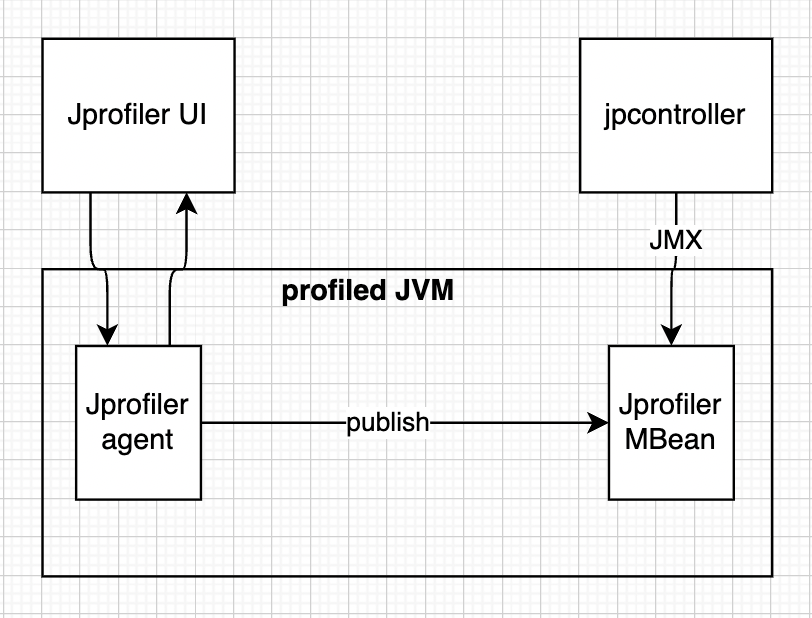

# Cloud Provider 

## Background
Profiling is a dynamic code analysis. Profilers capture characteristics of the application as it runs, and then developers use this information to make applications faster and more efficient. For example, one of the most known JVM profilers is [JProfiler](https://www.ej-technologies.com/resources/jprofiler/help/doc/JProfiler.pdf). JProfiler collects the following data: methods calls data (aka CPU profiling), allocations (heap allocations, GC), threads and locks and data from higher level subsystems like JDBC, HTTP, etc. Two main components of JProfiler are JProfiler UI and JProfiler agent.

<table width="256px">
  <tr>
    <td></td>
  </tr>
  <tr><td align="center">JProfiler</td></tr>
</table>  

Jprofiler agent uses the JVM tool interface. JVMTI is a native interface that a profiler uses to gain access to information and add hooks for inserting its own instrumentation. This means that at least part of the profiling agent must be implemented as native code and so a JVM profiler is not platform independent. To load the agent at startup, a VM parameter [-agentpath:] is added to the command line. Once loaded, the profiling agent tasks the JVMTI to be notified of all kinds of events, such as thread creation or class loading. Some of these events directly deliver profiling data. Using the class loading event, the profiling agent instruments classes as they are loaded and inserts its own byte-code to perform its measurements. The JProfiler agent only collects the profiling data. The JProfiler UI is started separately and connects to the profiling agent through a socket. This means that it is actually irrelevant if the profiled JVM is running on the local machine or on a remote machine - the communication mechanism between the profiling agent and the JProfiler UI is always the same. JProfiler can work in two modes: on start and attach. In attach mode the JProfiler agent is loaded on the fly and is limited, because some features are not available in later phases of JVM lifecycle (see JVMTI specs).

## Problem Statement
Profiling distributed cloud applications cannot be done by commodity profilers. Here are some challenges:
- [Elasticity](https://en.wikipedia.org/wiki/Elasticity_(cloud_computing)): Cloud Applications scale out and in dynamically to adapt to workload changes. Standalone profiles lack the ability to automatically discover and attach to new running instances of the same application.
- [Security](https://www.crowdstrike.com/cybersecurity-101/cloud-security/): Cloud Application are running in isolated environments, meaning that there is no direct network access, and it is hard to attach or inject the profiler's agent.
- [Cross-Language](https://damientseng.com/spark/2017/11/20/pyspark-udf-a-cross-language-approach.html): Some Cloud Application designed with a layered approach in mind. Fore example, in PySpark, Python Code run on top of Spark Core (JVM)
- [Microservice Architecture](https://en.wikipedia.org/wiki/Microservices): Some Cloud Applications designed as a collection of loose-coupled services. A cross process profiling capability can help to find performance issues. 
- [Data Volume](https://en.wikipedia.org/wiki/Big_data): profiling a High Scale Cloud Application will generate a lot of data. For example, JProfiler generates ~20 KB/sec.
- [Actionable Insights](https://en.wikipedia.org/wiki/Recommender_system): Today's standalone profilers are simple and require a lot of domain knowledge to make sense of collected data.
- [Performance Testing](https://en.wikipedia.org/wiki/Software_performance_testing): Standalone Profilers have no capability to perform side by side comparison of two different sessions.   

## Facts and Observation
- There are a bunch of existing products in this area. For example [AWS CodeGuru](https://aws.amazon.com/codeguru/), [Google Cloud Profiler](https://cloud.google.com/profiler/docs), [Pyroscope](https://www.infracloud.io/blogs/continuous-profiling-kubernetes-pyroscope/).

## Solution
