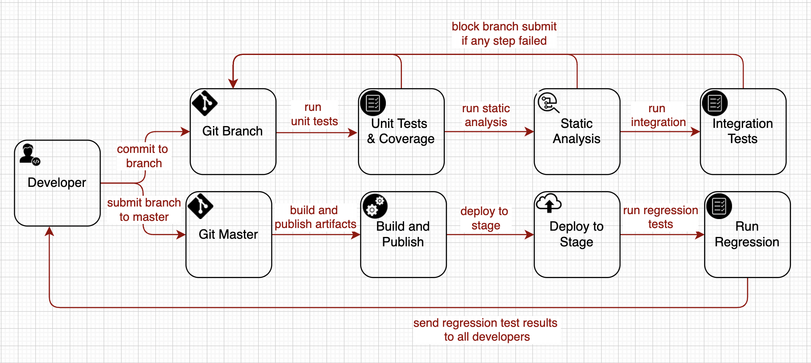

# Cloud Profiler - Operational Excellence 

## Background
Cloud Profiler continuously gathers CPU usage and memory-allocation information from Cloud Applications. It attributes that information to the source code that generated it, helping you identify the parts of applications that are consuming the most resources, and otherwise illuminating application performance characteristics. Cloud Profiler addresses a lot of challenges in profiling Cloud Applications like Elasticity, Security, Data Volume and by itself has a Cloud Application Structure. Cloud Profiler has a Micro Services structure. These services developed in different programming languages C++, Java, Go, JavaScript, Python. Such an Application is really difficult to maintain. This document contains a bunch of ideas about implementing code quality validations, regressions and e2e testing of Cloud Profiler.

<table width="256px">
  <tr>
    <td></td>
  </tr>
  <tr><td align="center">Cloud Profiler</td></tr>
</table>  

## Objectives
- Improve development velocity: allow development team to work efficiently and focus on adding new features by keeping a clean and healthy codebase. 
- Allow deploying frequently: allow deploying frequent, small, and reversible changes to reduce the scope of a change. This results in easier troubleshooting and faster remediation.
- Mitigate deployment risk: test changes and validate the results as soon as possible, to confirm new features and minimize the risk and impact of failed deployments.
- Visibility: obtain a visibility on a current health state of the integration environment

## Solution

### CI/CD
CI/CD pipeline builds the incremental code changes made by developers, then package them into software deliverables, deploys to the target environment and run tests. Automated tests verify the software functionality and can block deployment due to tests failure. When designed correctly, CI/CD pipelines enforce early defect discovery, increase productivity, and provide faster release cycles. 

<table width="256px">
  <tr>
    <td></td>
  </tr>
  <tr><td align="center">CI/CD</td></tr>
</table>  

- Protect master:
    - 1. Run unitests and integartion tests before submit(merge to master).

- Stability (continues integration test):
- 1. Integration Test (Jenkins Job)
    - Regression Tests (run test application - dedicated to regression tests)
    
    1. Test Gateway endpoint:
        - Open Session
        - Test Mongo for metadata
        - Test Elastic for data
        - Test Data consistency
        - Close Session
    
    2. Test Recomendation
        - Test the number of recomendations
        - Test recomendation validity   
        - 

    2. Metrics based Tests (advanced) 
 
    - 3. Recomendation is running
    - 4. Test Propress

## Milestones

### Milestone 1