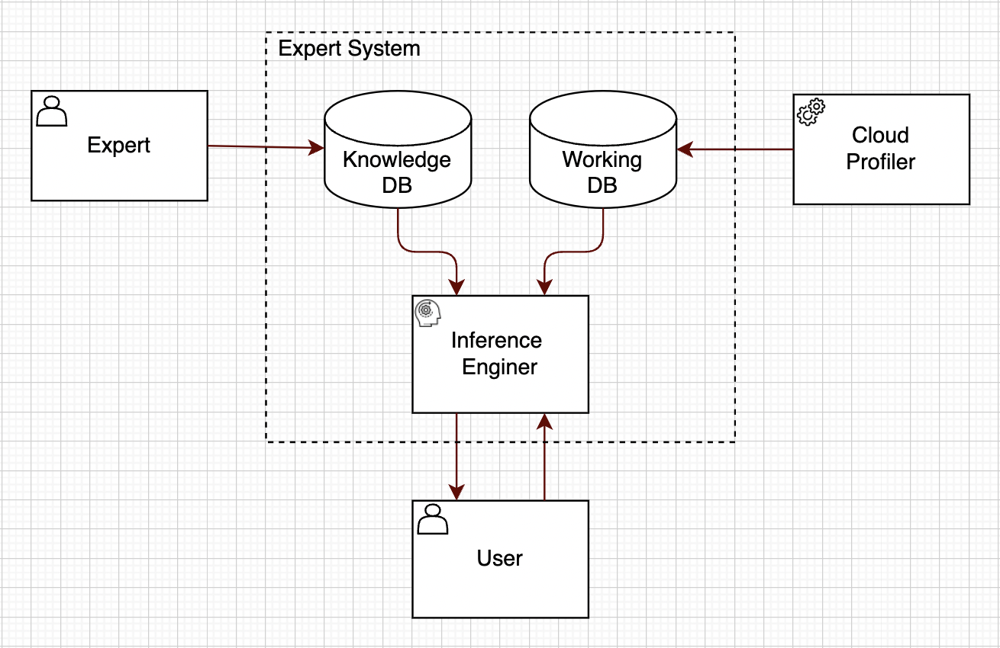
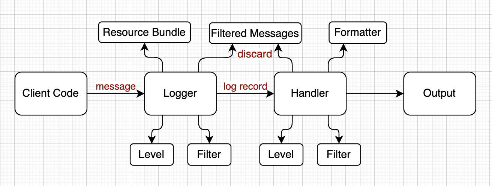

# An Expert System for Software Profiling

## Background
Profiling is a dynamic code analysis. Profilers capture characteristics of the application as it runs, and then developers use this information to make applications faster and more efficient. For example, one of the most known JVM profilers is [JProfiler](https://www.ej-technologies.com/resources/jprofiler/help/doc/JProfiler.pdf). JProfiler collects the following data: methods calls data (aka CPU profiling), allocations (heap allocations, GC), threads and locks and data from higher level subsystems like JDBC, HTTP, etc. All collected data is shown in JProfiler's UI. By examining data on Jprofiler UI, developers can figure out if there any problem in the profiled application and hopefully find a root cause for it. However, it is really hard to make sense of profilers output. One should be an expert with many years of a hands-on experience in Java programming language in order to make sense of data that is shown on JProfiler UI.  
This document describes the design of the Knowledge-Based (Expert) System for Software Profiling. Knowledge-Based systems are computer programs that use [AI](https://en.wikipedia.org/wiki/Artificial_intelligence) technologies to simulate the judgment and behavior of a human or an organization that has expertise and experience in a particular field. Expert systems are usually intended to complement, not replace humans.

<table width="256px">
  <tr>
    <td></td>
  </tr>
  <tr><td align="center">Expert Systems</td></tr>
</table>  


## Requirements

### Functional Requirements
- Actor 1: Domain Expert
    - Knowledge Acquisition: gather the knowledge about profiling 
    - Knowledge Engineering: build the knowledge database 

- Actor 2: Non-Expert User
    - Query Inference Engine
- Actor 3: Cloud Profiler
    - Generate profiling sessions aka working DB

### Non-Functional Requirements
[TBD]()

## High-Level Design
The Profiling Expert System consisting of the Knowledge and Inference Engine.
- Knowledge is a dataset that contains facts about the profiling domain
- Inference Engine is a program that processes the knowledge and solve the problem described in the working DB  


## Low-Level Design

### Flow 1: Profiling JVM Logging Frameworks

### Problem Statement
Logging runtime information in software application is critically useful for understanding the behavior of any app, especially in cases when encountering unexpected scenarios or errors in production environment. Usually, developers have no access to the production and can't use debugger and profilers. Here log data can help.   
Java takes a customizable and extensible approach to logging. Java provides a basic logging API through the java.util.logging package, and it can be implemented in a third party package. When an application makes a logging call, the Logger records the event in a LogRecord and forwards it to the appropriate Handler. The Handler then formats the record using a Layout before sending it a destination such as the console, a file, or another application. Additionally, you can use one or more Filters to specify which Handler should be used for which events. Filters aren’t required, but they give you greater control over the flow of your log messages.

<table width="256px">
  <tr>
    <td></td>
  </tr>
  <tr><td align="center">JVM Logger</td></tr>
</table>  

Improper usage of logging can have a significant impact on overall performance of software applications. Here is the most common performance issues when making use of logging:

- Problem 1: logging in the Hot Path. Logging in a portion of the code that’s critical and executed very often is expensive. Unless it’s indispensable, you want to avoid logging here because it could cause an I/O bottleneck.
- Problem 2: expensive operation inside log. Logging can and does impact performance. One of the ways in which this can happen is when developers perform expensive function calls that could be avoided.
```java
log.info(String.format("message %s", expensiveCall()));
```
- Problem 3: excessive Logging. This can happen in an attempt to capture all potentially relevant data.
```java
logger.info("Starting method execution: " + joinPoint.getSignature().getName() + " in class:"+joinPoint.getSignature().getDeclaringTypeName());
Object result = joinPoint.proceed();
logger.info("Exiting method execution: " + joinPoint.getSignature().getName() + " in class:"+joinPoint.getSignature().getDeclaringTypeName());
```
- Problem 4: logging large messages. Consider an example when developer logs responses with payloads that come from external services. Another well known example when logging error with long stack traces.
- Problem 5: slow write operations. By default, logging is blocking. When the runtime executes the log statement, the log gets written on the disk. The speed of writing onto the disk depends a lot on the underlying hardware which may be slow..

   
### Objectives
Here is the list of recommendation to improve logging performance.

- Recommendation for logging in the Hot Path:
  - Change log filtering leaving only ERROR logs in the Hot Path.
  - Avoid logging in the Hot Path when possible.
- Recommendation for expensive operation inside logs:
  - Avoid expensive operation inside logs.
- Recommendation for excessive logging:
  - Avoid excessive logging when possible
- Recommendation for logging large messages:
  - Consider using asynchronous logging 
- Recommendation for slow writes operations
  - Enable buffered logging


### Solution

#### Static Diagram
The required recommendations will be implemented by re-using existing Recommendation Engine Infrastructure. Main infrastructures classes are Engine, Flow, Investigation, Steps and Summary.

<table width="256px">
  <tr>
    <td></td>
  </tr>
  <tr><td align="center">Recommendation Engine Infrastructure</td></tr>
</table> 

On Recommendation Engine activation, each one of the investigations(LoggerSlowWritesInvestigation, LoggerExpensiveOperationInvestigation, LoggerHotPathInvestigation, LoggerExcessiveWritesInvestigation, LoggerLargeMessagesInvestigation) will run and use the Processor Query API to obtain the CPU Usage Samplings and Heap Allocation Samplings.

#### CPU Usage Sampling Structure
Required fields for CPU Usage Sampling
- Number of Calls: number of calls for each method
- Total Time: for the total time spent in the given function (excluding time made in calls to sub-functions)
- Per Call: is the quotient of Total Time divided by Number of Calls
- Cumulative Time: time spent in this and all subfunctions
- Per Call: is the quotient of Cumulative Time divided by Number of Calls

#### Heap Allocation Sampling Structure
- Allocated Bytes: amount of allocation in bytes 
- Allocated Objects: number of allocated objects
- Live Bytes: amount of allocated and not collected by GC bytes
- Live Objects: number of allocated and not collected by GC objects
- Self (Percent): amount of allocation in percents not including upper frames 
- Accum (Percent): ammout of allocation in percents including upper frames
- Class Name: class where allocations happened

The data can look as follows in profiler
```Bash

SITES BEGIN (ordered by live bytes) Fri Oct 22 11:52:24 2022
          percent          live          alloc-ed  stack class
 rank   self  accum     bytes objs     bytes  objs trace name
    1 44.73% 44.73%   1161280 14516  1161280 14516 302032 java.util.zip.ZipEntry
    2  8.95% 53.67%    232256 14516   232256 14516 302033 com.sun.tools.javac.util.List
    3  5.06% 58.74%    131504    2    131504     2 301029 com.sun.tools.javac.util.Name[]
    4  5.05% 63.79%    131088    1    131088     1 301030 byte[]
    5  5.05% 68.84%    131072    1    131072     1 301710 byte[]
```

#### Sequence Diagram for Hot Path Investigations
Hot Path Investigation is pretty straightforward and fully relies on CPU Usage Samplings. First, CPU Usage Sampling data is loaded from the Processor Query API. Then Hot Path Investigation runs FindHotPath Step to find the most expensive paths in terms of number of invocation and execution time. The next step finds the usage of one of JVM Logging Frameworks in the Hot Path. If logging is not found, the investigation terminates. Otherwise, Hot Path Investigation will generate the ChangeLogLevel recommendation if logLevel != ERROR. If logLevel == ERROR, Hot Path Investigation will generate AvoidLoggingInHotPath recommendation.

<table width="256px">
  <tr>
    <td></td>
  </tr>
  <tr><td align="center">Hot Path Investigation</td></tr>
</table> 


### Flow 2: [TBD]()


